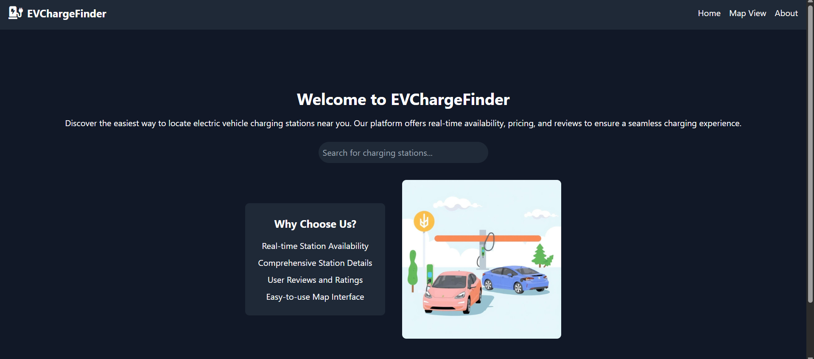
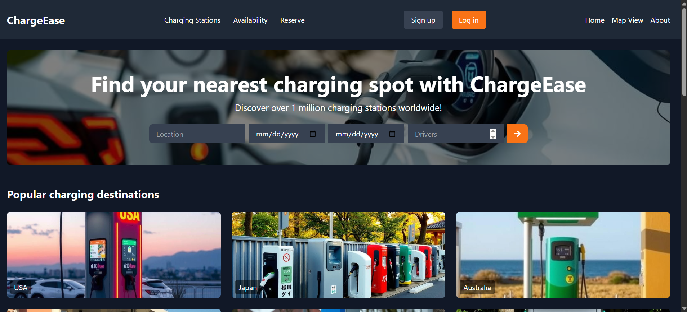
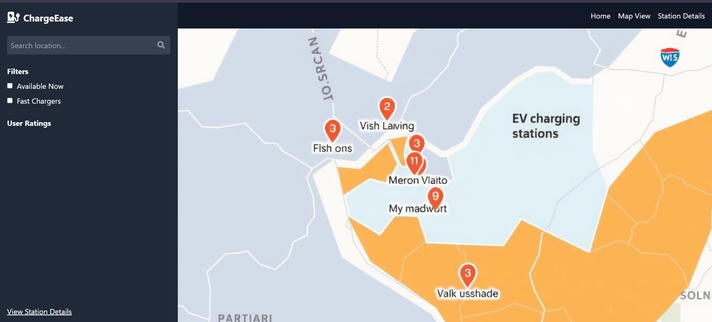

# ⚡ ChargeEase

<div align="center">


**🚗 Find your nearest EV charging spot with ease**

*Discover over 1 million charging stations worldwide with real-time availability*

[](https://chargease.netlify.app/)
[]([https://docs.chargeease.com](https://drive.google.com/drive/folders/1wQ-bhPedmQzEgTw-ugqGbJezAWTuHBjB?usp=sharing))

---

[](https://reactjs.org/)
[](https://www.typescriptlang.org/)
[](https://vitejs.dev/)
[](https://tailwindcss.com/)
[](https://nodejs.org/)

[](https://github.com/yourusername/chargeease/actions)
[](LICENSE)
[](https://codecov.io/gh/yourusername/chargeease)
[](https://github.com/yourusername/chargeease/graphs/contributors)

</div>

## 🌟 Overview

**ChargeEase** is a comprehensive, full-stack EV (Electric Vehicle) charging station finder that revolutionizes how drivers locate, book, and manage their charging sessions. With access to over **1 million charging stations worldwide**, ChargeEase makes electric vehicle ownership convenient, efficient, and stress-free.

### 🎯 Our Mission
> *To accelerate the adoption of electric vehicles by making charging infrastructure easily accessible and user-friendly for everyone, everywhere.*

### 🌍 Global Impact
- 🎯 **Target**: 1M+ charging stations by 2026
- 🌍 **Planned Coverage**: 150+ countries by launch
- 📈 **Goal**: 100K+ users in first year
- 🚀 **Vision**: 1M+ charging sessions facilitated

---

## ✨ Key Features

### 🔍 **Intelligent Search Engine** (In Development)
- 📍 **GPS-powered location discovery** (Q3 2024)
- 🕐 **Real-time availability tracking** (Q4 2024)
- 🔌 **Advanced filtering** (Beta testing)
- 🗺️ **Interactive maps** (MVP ready)
- 📏 **Smart sorting** (Planned for v1.0)

### 🏆 **Content Hub** (Coming Soon)
- 🌟 **Popular destinations** (Q4 2024)
- ⭐ **Community reviews** (v1.1 planned)
- 🎯 **AI recommendations** (2025 roadmap)

### 👥 **ChargeEase Club** (Future Release)
- 💳 **Member discounts** (Partnership negotiations)
- 📲 **Push notifications** (Development phase)
- 🎁 **Loyalty program** (Business model finalization)

---

## 🛠️ Technology Stack

### **Frontend Architecture**

| Technology | Version | Purpose | Features |
|------------|---------|---------|----------|
|   | 19.0.0 | Core UI Framework | Hooks, Context API, Suspense |
|  | 5.7.2 | Type Safety | Strict mode, Custom types |
|   | 6.2.0 | Build Tool & Dev Server | HMR, Code splitting |
|   | 4.1.1 | Utility-First Styling | Custom components, Dark mode |
|   | 12.9.2 | Animations & Gestures | Page transitions, Micro-interactions |
|   | 7.5.2 | Client-Side Routing | Lazy loading, Code splitting |
|   | 5.x | State Management | Caching, Background updates |
|   | 7.x | Form Management | Validation, Performance |

### **Backend Infrastructure**

| Technology | Version | Purpose | Features |
|------------|---------|---------|----------|
|   | 20.x | JavaScript Runtime | ES modules, Worker threads |
|   | 4.x | Web Framework | Middleware, Routing |
|   | 9+ | Realtime DB/Auth | JWT Auth, Realtime Sync |
|   | 7.x | Caching & Sessions | Pub/Sub, Rate limiting |
|   | 4.x | Real-time Communication | Live updates, Notifications |
|  | Latest | Authentication | Secure, Stateless |

### **Development & Deployment**

| Tool | Purpose | Features |
|------|---------|----------|
|   | Containerization | Multi-stage builds, Compose |
|   | CI/CD Pipeline | Automated testing, Deployment |
|   | Code Quality | Custom rules, Auto-fix |
|   | Code Formatting | Consistent styling |
|   | Testing Framework | Unit, Integration tests |
|   | E2E Testing | Visual regression, API testing |

---

## 🚀 Getting Started

### 📋 Prerequisites

Ensure you have the following installed on your system:

- 
-  or 
- 
-  (Local or Atlas)

### ⚡ Quick Start

1. **Clone the repository**
   ```bash
   git clone https://github.com/yourusername/chargeease.git
   cd chargeease
   ```

2. **Install dependencies for both frontend and backend**
   ```bash
   # Install root dependencies
   npm install

   # Install frontend dependencies
   cd frontend && npm install

   # Install backend dependencies
   cd ../backend && npm install
   ```

3. **Set up environment variables**
   ```bash
   # Backend environment
   cd backend
   cp .env.example .env
   
   # Edit .env with your configuration:
   # DATABASE_URL=mongodb://localhost:27017/chargeease
   # JWT_SECRET=your-super-secret-jwt-key
   # REDIS_URL=redis://localhost:6379
   # STRIPE_SECRET_KEY=sk_test_...
   ```

4. **Start the development servers**

   **Option 1: Using concurrently (Recommended)**
   ```bash
   # From root directory
   npm run dev
   # This starts both frontend and backend simultaneously
   ```

   **Option 2: Separate terminals**
   ```bash
   # Terminal 1: Backend
   cd backend && npm run dev
   # Server runs on http://localhost:5000

   # Terminal 2: Frontend
   cd frontend && npm run dev
   # App runs on http://localhost:5173
   ```

5. **Open your browser**
   Navigate to `http://localhost:5173` to see ChargeEase in action! 🎉

### 🐳 Docker Setup (Alternative)

```bash
# Build and run with Docker Compose
docker-compose up --build

# Access the application at http://localhost:3000
```

---

## 📂 Project Architecture

```
chargeease/
├── frontend/                    # React TypeScript frontend
│   ├── public/                  # Static assets
│   │   ├── favicon.ico
│   │   ├── manifest.json
│   │   └── robots.txt
│   ├── src/
│   │   ├── components/          # Reusable UI components
│   │   │   ├── common/          # Shared components
│   │   │   │   ├── Button.tsx
│   │   │   │   ├── Input.tsx
│   │   │   │   ├── Loading.tsx
│   │   │   │   └── ErrorBoundary.tsx
│   │   │   ├── home/            # Home page components
│   │   │   │   ├── Hero.tsx              # Hero section with CTA
│   │   │   │   ├── SearchBar.tsx        # Advanced search component
│   │   │   │   ├── PopularDestinations.tsx
│   │   │   │   ├── TopRatedSpots.tsx
│   │   │   │   ├── ChargingClub.tsx     # Membership features
│   │   │   │   ├── Statistics.tsx       # Usage statistics
│   │   │   │   └── Features.tsx         # Feature highlights
│   │   │   ├── auth/            # Authentication components
│   │   │   │   ├── SignUpForm.tsx
│   │   │   │   ├── LoginForm.tsx
│   │   │   │   └── ProtectedRoute.tsx
│   │   │   ├── dashboard/       # User dashboard
│   │   │   │   ├── Analytics.tsx
│   │   │   │   ├── BookingHistory.tsx
│   │   │   │   └── Settings.tsx
│   │   │   └── layout/          # Layout components
│   │   │       ├── Header.tsx
│   │   │       ├── Footer.tsx
│   │   │       └── Layout.tsx
│   │   ├── pages/               # Page components
│   │   │   ├── Home.tsx
│   │   │   ├── Search.tsx
│   │   │   ├── Dashboard.tsx
│   │   │   ├── About.tsx
│   │   │   └── Contact.tsx
│   │   ├── hooks/               # Custom React hooks
│   │   │   ├── useApi.ts
│   │   │   ├── useGeolocation.ts
│   │   │   └── useAuth.ts
│   │   ├── services/            # API services
│   │   │   ├── chargingStations.ts
│   │   │   ├── auth.ts
│   │   │   └── payments.ts
│   │   ├── utils/               # Utility functions
│   │   │   ├── theme.ts
│   │   │   ├── helpers.ts
│   │   │   └── constants.ts
│   │   ├── types/               # TypeScript type definitions
│   │   │   ├── station.ts
│   │   │   ├── user.ts
│   │   │   └── api.ts
│   │   ├── assets/              # Static assets
│   │   │   ├── images/
│   │   │   ├── icons/
│   │   │   └── logos/
│   │   ├── App.tsx              # Main app component
│   │   ├── main.tsx             # App entry point
│   │   └── index.css            # Global styles
│   ├── package.json             # Frontend dependencies
│   ├── vite.config.ts           # Vite configuration
│   ├── tsconfig.json            # TypeScript config
│   └── tailwind.config.js       # Tailwind CSS config
├── backend/                     # Express.js backend
│   ├── src/
│   │   ├── controllers/         # Route controllers
│   │   │   ├── stationController.js
│   │   │   ├── userController.js
│   │   │   └── bookingController.js
│   │   ├── models/              # Database models
│   │   │   ├── Station.js
│   │   │   ├── User.js
│   │   │   └── Booking.js
│   │   ├── routes/              # API routes
│   │   │   ├── stations.js
│   │   │   ├── users.js
│   │   │   └── auth.js
│   │   ├── middleware/          # Express middleware
│   │   │   ├── auth.js
│   │   │   ├── errorHandler.js
│   │   │   └── validation.js
│   │   ├── services/            # Business logic
│   │   │   ├── stationService.js
│   │   │   ├── paymentService.js
│   │   │   └── emailService.js
│   │   ├── utils/               # Utility functions
│   │   │   ├── database.js
│   │   │   └── logger.js
│   │   └── server.js            # Main server file
│   ├── tests/                   # Backend tests
│   │   ├── stations.test.js
│   │   └── users.test.js
│   ├── package.json             # Backend dependencies
│   └── .env.example             # Environment variables template
├── shared/                      # Shared utilities
│   ├── types/                   # Shared TypeScript types
│   └── constants/               # Shared constants
├── docs/                        # Documentation
│   ├── API.md                   # API documentation
│   ├── deployment.md            # Deployment guide
│   └── contributing.md          # Contribution guidelines
├── docker-compose.yml           # Docker configuration
├── .github/                     # GitHub workflows
│   └── workflows/
│       ├── ci.yml               # Continuous Integration
│       └── deploy.yml           # Deployment workflow
├── README.md                    # This file
├── LICENSE                      # MIT License
└── .gitignore                   # Git ignore rules
```

---

## 🎯 Usage Guide

### 🔍 **Finding Charging Stations**

1. **🌍 Location-Based Search**
   - Enter your destination in the search bar
   - Use current location with GPS integration
   - Set search radius (1-50 miles)

2. **📅 Advanced Filtering**
   - Filter by charging speed (Level 1, 2, DC Fast)
   - Select connector types (J1772, CCS, CHAdeMO)
   - Set price range and availability preferences

3. **🗺️ Interactive Map View**
   - Browse stations on an interactive map
   - View real-time availability status
   - Get turn-by-turn directions

### 🏆 **Exploring Popular Features**

- **🌟 Trending Destinations**: Discover EV-friendly locations with charging infrastructure
- **⭐ Community Reviews**: Read authentic reviews from fellow EV drivers
- **🎯 Smart Recommendations**: Get personalized suggestions based on your driving patterns

### 👤 **Account Management**

- **📝 Registration**: Create your ChargeEase account with email or social login
- **🔐 Secure Login**: Access your personalized dashboard
- **📊 Usage Analytics**: Track your charging history and carbon footprint
- **⚙️ Preferences**: Customize your experience with vehicle and charging preferences

### 💳 **Booking & Payment**

- **📅 Reserve charging slots** in advance
- **💰 Integrated payments** with multiple options
- **🎁 Loyalty rewards** and membership discounts
- **🧾 Detailed billing** with cost breakdowns

---

## 🔧 Development

### 📜 Available Scripts

#### **Root Level Scripts**
```bash
npm run dev          # Start both frontend and backend
npm run build        # Build both applications
npm run test         # Run all tests
npm run lint         # Lint all code
npm run format       # Format code with Prettier
```

#### **Frontend Scripts**
```bash
npm run dev          # Start Vite dev server (http://localhost:5173)
npm run build        # Build for production
npm run preview      # Preview production build
npm run test         # Run frontend tests
npm run test:ui      # Run tests with UI
npm run lint         # Run ESLint
npm run type-check   # TypeScript type checking
```

#### **Backend Scripts**
```bash
npm run dev          # Start with nodemon (http://localhost:5000)
npm run start        # Start production server
npm run test         # Run backend tests
npm run test:watch   # Run tests in watch mode
npm run seed         # Seed database with sample data
```

### 🎨 **Design System & Styling**

ChargeEase uses a comprehensive design system built with **Tailwind CSS**:

#### **Color Palette**
```css
/* Primary Colors */
--orange-primary: #FF6B35;    /* Main brand color */
--orange-light: #FF8A65;      /* Hover states */
--orange-dark: #E55722;       /* Active states */

/* Neutral Colors */
--gray-900: #1F2937;          /* Dark backgrounds */
--gray-800: #374151;          /* Card backgrounds */
--gray-600: #6B7280;          /* Text secondary */
--gray-300: #D1D5DB;          /* Borders */
--white: #FFFFFF;             /* Text primary */

/* Status Colors */
--success: #10B981;           /* Available stations */
--warning: #F59E0B;           /* Limited availability */
--error: #EF4444;             /* Unavailable */
--info: #3B82F6;              /* Informational */
```

#### **Typography Scale**
- **Display**: 48px/56px - Hero headings
- **H1**: 36px/40px - Page titles
- **H2**: 30px/36px - Section headers
- **H3**: 24px/32px - Subsections
- **Body**: 16px/24px - Regular text
- **Small**: 14px/20px - Captions

#### **Component Architecture**
- **Atomic Design**: Atoms → Molecules → Organisms → Templates → Pages
- **Consistent Spacing**: 8px grid system (4, 8, 16, 24, 32, 48, 64px)
- **Responsive Breakpoints**: Mobile-first approach
- **Accessibility**: WCAG 2.1 AA compliance

### 🧪 **Testing Strategy**

#### **Frontend Testing**
```bash
# Unit Tests
npm run test                    # Jest + React Testing Library

# Component Tests  
npm run test:components         # Isolated component testing

# E2E Tests
npm run test:e2e               # Cypress end-to-end tests

# Visual Regression Tests
npm run test:visual            # Chromatic visual testing
```

#### **Backend Testing**
```bash
# API Tests
npm run test:api               # Supertest API testing

# Integration Tests
npm run test:integration       # Database integration tests

# Performance Tests
npm run test:performance       # Load testing with Artillery
```

### 🚀 **Performance Optimization**

- **Code Splitting**: Route-based and component-based splitting
- **Lazy Loading**: Images and non-critical components
- **Caching Strategy**: Redis for API responses, browser caching for assets
- **Bundle Analysis**: Regular bundle size monitoring
- **CDN**: Static assets served via CDN

---
### 🎨 **Development Preview**
*Current development state and planned features*


*Home page wireframe and current implementation*


*Search interface mockup - Currently in development*

### 🗺️ **Interactive Map View**
*Live station availability with detailed information panels - Currently in development *



> **Note**: Screenshots show development mockups and may not represent final design
</div>

---

## 🎨 **Brand Identity & Assets**

<div align="center">

### ⚡ **Logo Variations**

| **Primary Logo** | **Icon Only** | **Light Version** | **Dark Version** |
|:---:|:---:|:---:|:---:|
|  |  |  |  |

### 🎨 **Brand Colors**

| Color | Hex | Usage |
|-------|-----|-------|
| 🟠 **Primary Orange** | `#FF6B35` | CTAs, highlights, brand elements |
| ⚫ **Dark Gray** | `#1F2937` | Backgrounds, text |
| ⚪ **White** | `#FFFFFF` | Text, cards, contrast |
| 🔘 **Medium Gray** | `#6B7280` | Secondary text, borders |

</div>

### 📁 **Asset Organization**

```
frontend/src/assets/
├── 📁 images/
│   ├── hero-background.webp
│   ├── charging-station.webp
│   └── app-screenshots/
├── 📁 icons/
│   ├── charging-types/
│   ├── amenities/
│   └── ui-icons/
├── 📁 logos/
│   ├── chargeease-primary.svg
│   ├── chargeease-icon.svg
│   ├── chargeease-light.svg
│   └── partners/
└── 📁 animations/
    ├── loading-spinner.json
    └── success-animation.json
```

---

### 🚧 **Development Phase Contributions**

As ChargeEase is in active development, we especially need help with:

- 🎨 **UI/UX Design**: Finalizing component designs
- 🔧 **Core Features**: Implementing search and booking logic  
- 🧪 **Testing**: Writing unit and integration tests
- 📖 **Documentation**: API docs and user guides
- 🔍 **Code Review**: Helping maintain code quality

### 🎯 **Priority Areas**
1. **Search Algorithm**: Help improve station discovery
2. **Real-time Data**: WebSocket implementation
3. **Mobile Optimization**: Responsive design improvements
4. **Testing Coverage**: Increase from current 45% to 80%

### ⚠️ Development Setup

**Note**: ChargeEase is currently in active development. Some features may be incomplete or experimental.

1. **🍴 Fork the repository**
   ```bash
   git clone https://github.com/yourusername/chargeease.git
   ```

2. **🌿 Create a feature branch**
   ```bash
   git checkout -b feature/amazing-new-feature
   ```

3. **💻 Make your changes**
   - Follow our coding standards
   - Add tests for new features
   - Update documentation

4. **🧪 Test your changes**
   ```bash
   npm run test
   npm run lint
   npm run type-check
   ```

5. **📝 Commit with conventional commits**
   ```bash
   git commit -m "feat: add real-time station availability updates"
   git commit -m "fix: resolve payment processing issue"
   git commit -m "docs: update API documentation"
   ```

6. **🚀 Push and create PR**
   ```bash
   git push origin feature/amazing-new-feature
   ```
   
   Then create a Pull Request with:
   - Clear title and description
   - Screenshots for UI changes
   - Link to related issues

### 📋 **Contribution Guidelines**

#### **Code Standards**
- ✅ **ESLint**: Follow our linting rules
- 🎨 **Prettier**: Consistent code formatting
- 📝 **TypeScript**: Strong typing for better code quality
- 🧪 **Testing**: Maintain 80%+ test coverage
- 📖 **Documentation**: Comment complex logic

#### **Commit Convention**
We use [Conventional Commits](https://www.conventionalcommits.org/) for clear commit history:

```
type(scope): description

Types:
- feat: New features
- fix: Bug fixes
- docs: Documentation changes
- style: Code style changes
- refactor: Code refactoring
- test: Test additions/modifications
- chore: Build process or auxiliary tool changes
```

#### **Pull Request Process**
1. ✅ Ensure all tests pass
2. 📝 Update documentation if needed
3. 🔄 Rebase your branch on latest main
4. 👥 Request review from maintainers
5. ✨ Address feedback promptly

### 🐛 **Bug Report Template**

When reporting bugs, please include:

```markdown
## Bug Description
Clear description of the issue

## Steps to Reproduce
1. Go to '...'
2. Click on '....'
3. See error

## Expected Behavior
What should happen

## Environment
- OS: [e.g. macOS, Windows, Linux]
- Browser: [e.g. Chrome, Firefox, Safari]
- Version: [e.g. 1.2.3]
- Device: [e.g. Desktop, Mobile]
```

### 💡 **Feature Request Template**

```markdown
## Feature Summary
Brief description of the feature

## Problem Statement
What problem does this solve?

## Proposed Solution
How should it work?

## Alternatives Considered
Other approaches you've thought about

## Additional Context
Screenshots, mockups, or examples
```

---

## 🚀 Deployment

### 🌐 **Production Deployment**

#### **Frontend Deployment (Vercel)**
# ⚠️ Development Environment Variables
# Some APIs may use mock data during development
```bash
# Install Vercel CLI
npm i -g vercel

# Deploy to production
vercel --prod

# Environment variables in Vercel dashboard:
# VITE_API_URL=https://api.chargeease.com
# VITE_STRIPE_PUBLIC_KEY=pk_live_...
```

#### **Backend Deployment (Railway/Heroku)**
# ⚠️ Development Environment Variables
# Some APIs may use mock data during development
```bash
# Using Railway
railway login
railway init
railway add mongodb redis
railway deploy

# Environment variables:
# DATABASE_URL=mongodb://...
# REDIS_URL=redis://...
# JWT_SECRET=super-secret-key
# STRIPE_SECRET_KEY=sk_live_...
```

#### **Database Setup (Firebase)**
1. Create a Firebase project in the [Firebase Console](https://console.firebase.google.com/).
2. Set up Firebase Firestore or Realtime Database (depending on your choice).
3. Enable Firestore or Realtime Database rules for your app's access.
4. Configure Firebase Authentication (if required).
5. Get your Firebase credentials (API key, project ID, etc.) and add them to your environment variables.
6. Initialize Firebase SDK in your application.


### 🐳 **Docker Production**

```dockerfile
# Multi-stage Dockerfile
FROM node:20-alpine AS builder
WORKDIR /app
COPY package*.json ./
RUN npm ci --only=production

FROM node:20-alpine AS runtime
WORKDIR /app
COPY --from=builder /app/node_modules ./node_modules
COPY . .
EXPOSE 3000
CMD ["npm", "start"]
```

```yaml
# docker-compose.prod.yml
version: '3.8'
services:
  app:
    build: .
    ports:
      - "3000:3000"
    environment:
      - NODE_ENV=production
      - DATABASE_URL=${DATABASE_URL}
    depends_on:
      - mongodb
      - redis

  mongodb:
    image: mongo:7
    volumes:
      - mongodb_data:/data/db

  redis:
    image: redis:7-alpine
    volumes:
      - redis_data:/data

volumes:
  mongodb_data:
  redis_data:
```

### 🔄 **CI/CD Pipeline**

```yaml
# .github/workflows/deploy.yml
name: Deploy to Production

on:
  push:
    branches: [main]

jobs:
  test:
    runs-on: ubuntu-latest
    steps:
      - uses: actions/checkout@v4
      - uses: actions/setup-node@v4
        with:
          node-version: '20'
      - run: npm ci
      - run: npm run test
      - run: npm run build

  deploy:
    needs: test
    runs-on: ubuntu-latest
    steps:
      - uses: actions/checkout@v4
      - name: Deploy to Production
        run: |
          # Deploy commands here
```

---

### 🎯 **Performance Targets** (Development Goals)

| Metric | Target 2026 | Current Dev | Status |
|--------|-------------|-------------|---------|
| First Contentful Paint | < 1.5s | 2.3s | 🚧 Optimizing |
| Bundle Size | < 250KB | 320KB | 🚧 Code splitting planned |
| Test Coverage | > 80% | 45% | 🚧 Writing tests |

### 📈 **Planned Analytics Stack**
- **📊 Google Analytics 4**: Setup planned for beta
- **🔍 Sentry**: Error tracking implementation in progress
- **📱 Monitoring Tools**: Evaluation phase

---

## 🛡️ **Security & Privacy**

### 🔐 **Security Measures**

- **🔒 HTTPS Everywhere**: SSL/TLS encryption
- **🛡️ CORS Protection**: Configured for production domains
- **🔐 JWT Authentication**: Secure token-based auth
- **🚫 Rate Limiting**: API abuse prevention
- **🧹 Input Sanitization**: XSS and injection prevention
- **🔒 Environment Variables**: Secure credential management

### 🕵️ **Privacy Compliance**

- **📋 GDPR Compliant**: European data protection
- **🇺🇸 CCPA Compliant**: California privacy rights
- **🍪 Cookie Policy**: Transparent cookie usage
- **📱 Data Minimization**: Collect only necessary data
- **🔄 Data Portability**: Export user data
- **🗑️ Right to Deletion**: Account and data removal

---

## 📚 **API Documentation**

### 🔗 **Base URL**
```
Production: https://api.chargeease.com/v1
Development: http://localhost:5000/api/v1
```

### 🔑 **Authentication**
```bash
# Get access token
POST /auth/login
{
  "email": "user@example.com",
  "password": "password"
}

# Use token in requests
Authorization: Bearer <your_jwt_token>
```

### 🔌 **Charging Stations API**

```bash
# Search stations
GET /stations?lat=40.7128&lng=-74.0060&radius=10

# Get station details
GET /stations/:id

# Check availability
GET /stations/:id/availability

# Make reservation
POST /stations/:id/reserve
{
  "startTime": "2024-07-21T14:00:00Z",
  "duration": 60,
  "connectorType": "CCS"
}
```

### 👤 **User Management API**

```bash
# User profile
GET /users/profile

# Update profile
PUT /users/profile
{
  "name": "John Doe",
  "vehicle": {
    "make": "Tesla",
    "model": "Model 3",
    "year": 2023
  }
}

# Charging history
GET /users/history?limit=10&offset=0
```

### 📊 **Response Format**

```json
{
  "success": true,
  "data": {
    "stations": [...],
    "pagination": {
      "total": 150,
      "page": 1,
      "limit": 10
    }
  },
  "meta": {
    "timestamp": "2024-07-21T12:00:00Z",
    "version": "1.0.0"
  }
}
```

For complete API documentation, visit: [📖 API Docs](https://docs.chargeease.com/api](https://drive.google.com/drive/folders/1wQ-bhPedmQzEgTw-ugqGbJezAWTuHBjB?usp=sharing))

---

## 🌍 **Internationalization**

ChargeEase supports multiple languages and regions:

### 🗣️ **Supported Languages**
- 🇺🇸 English (US)
- 🇪🇸 Spanish (ES)
- 🇫🇷 French (FR)
- 🇩🇪 German (DE)
- 🇯🇵 Japanese (JP)
- 🇨🇳 Chinese Simplified (CN)

### 🌐 **Localization Features**
- 📅 Date/time formatting
- 💰 Currency conversion
- 📏 Unit conversion (miles/km)
- 🔌 Regional charging standards
- 📱 Right-to-left language support

---

## 📈 **Roadmap**

### 🎯 **Q3 2024**
- [ ] 📱 Mobile app launch (iOS/Android)
- [ ] 🤖 AI-powered route optimization
- [ ] 🔋 Battery health monitoring
- [ ] 🏢 Corporate fleet management

### 🎯 **Q4 2024**
- [ ] 🌍 European market expansion
- [ ] ⚡ Ultra-fast charging support
- [ ] 🚗 Autonomous vehicle integration
- [ ] 🔄 Smart grid integration

### 🎯 **2025**
- [ ] 🌱 Carbon footprint tracking
- [ ] 🏠 Home charging solutions
- [ ] 🤝 OEM partnerships
- [ ] 🧠 Machine learning predictions

---

## 🎯 **Development Milestones**

<div align="center">

[](https://github.com/yourusername/chargeease)
[](https://github.com/yourusername/chargeease/contribute)

**🚧 Alpha Phase** - Core features in development  
**🎯 Beta Target** - Q4 2024  
**🚀 Public Launch** - Q2 2025

</div>

### 🎯 **Development Roadmap**

**Q3 2024 (Current Sprint)**
- [x] Basic UI components and layout
- [x] Authentication system
- [ ] Station search functionality (In Progress)
- [ ] Map integration (Next Sprint)
- [ ] Basic booking system (Design phase)

**Q4 2024 (Beta Preparation)**
- [ ] Real-time availability API
- [ ] Payment system integration
- [ ] User dashboard
- [ ] Mobile responsive design
- [ ] Beta testing program

**Q1 2025 (Pre-Launch)**
- [ ] Performance optimization
- [ ] Security audit
- [ ] Content management system
- [ ] Community features
- [ ] Documentation completion

**Q2 2025 (Public Launch)**
- [ ] Production deployment
- [ ] Marketing campaign
- [ ] User onboarding
- [ ] Support system
- [ ] Analytics implementation


## 📞 **Support & Contact**

### 🤝 **Get Help**
- 📖 [Documentation]([https://docs.chargeease.com](https://drive.google.com/drive/folders/1wQ-bhPedmQzEgTw-ugqGbJezAWTuHBjB?usp=sharing))
- 💬 [Discord Community](https://discord.gg/chargeease)
- 📧 [Email Support](mailto:support@chargeease.com)
- 🎫 [GitHub Issues](https://github.com/yourusername/chargeease/issues)

### 📱 **Connect With Us**
- 🐦 [Twitter](https://twitter.com/chargeease)
- 📘 [Facebook](https://facebook.com/chargeease)
- 📸 [Instagram](https://instagram.com/chargeease)
- 💼 [LinkedIn](https://linkedin.com/company/chargeease)

---

## 📄 **License**

This project is licensed under the **MIT License** - see the [LICENSE](LICENSE) file for details.

```
MIT License

Copyright (c) 2024 ChargeEase Team

Permission is hereby granted, free of charge, to any person obtaining a copy
of this software and associated documentation files (the "Software"), to deal
in the Software without restriction, including without limitation the rights
to use, copy, modify, merge, publish, distribute, sublicense, and/or sell
copies of the Software, and to permit persons to whom the Software is
furnished to do so, subject to the following conditions:

The above copyright notice and this permission notice shall be included in all
copies or substantial portions of the Software.
```

---

<div align="center">

## ⭐ **Show Your Support**

If you find ChargeEase helpful, please consider giving it a star! Your support helps us continue developing and improving the platform.

[](https://star-history.com/Unseencoderz/chargeease&Date)

[](https://github.com/Unseencoderz/ChargeEase/stargazers)
[](https://github.com/Unseencoderz/ChargeEase/network)
[](https://github.com/Unseencoderz/ChargeEase/watchers)

---

### 🚀 **Ready to Get Started?**

[](https://chargeease.com/signup)
[](https://chargeease.com)
[](https://docs.chargeease.com)

---

**Made with ⚡ and 💚 by the ChargeEase Team**

*Accelerating the future of electric mobility, one charge at a time* 🌱


</div>
